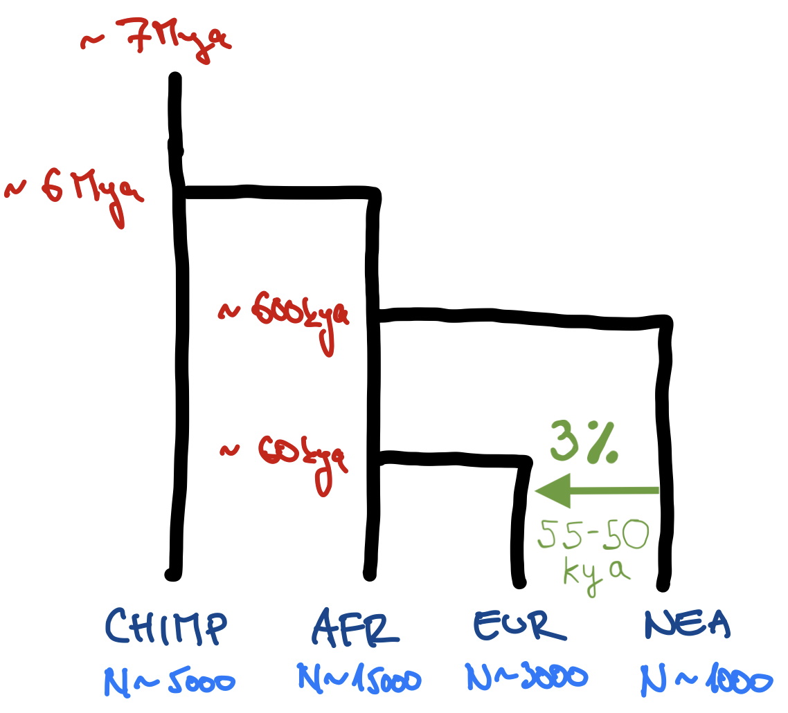

# Demographic models

In this session, you will practice building demographic models using the
programmable modeling interface of the R package _slendr_ (please make sure you
went through the [setup instructions](setup-slendr.html) first). Admittedly,
there are many valid definitions for what a "demographic model" could be, but
in the context of this book, we will generally think about models as "tree-like
topological structures encoding the relationships between populations and gene
flows between them". For completeness (and for the time being), these models
will be always neutral and will conform to Wright-Fisher assumptions
(random-mating individuals, non-overlapping generations, no selection).

**If you ever get _really_ stuck on one of the exercises, take a look
at solutions provided with each of them. The goal here is to learn things and
get you comfortable with computer programming, not fight through endless
frustration. That said, a little frustration is a necessary component of any
learning process, so try not to look at the solutions automatically and
immediately.** Always take a stab at solving each exercise on your own first and
then, if you decide to look at my solution, try to understand my code on your
own, step by step, before you run it by copying it into your R console.

## Exercise 1: Building a demographic model in _slendr_

**Take a look at the following toy model of human demographic history
(apologies for my bad handwriting and the lack of any artistic skill). Then
program this model using _slendr_ functions such as `population()`,
`gene_flow()`, and `compile_model()`, which we discussed in our introduction on
[_"Simulations with
_slendr_"_](https://bodkan.net/simgen/handouts_slendr.html).**

<center>
{width="50%"}
<small>
<br><br>
[Mya = million years ago,  kya = thousand years ago]
</small>
</center>

<br>

**Hint:** Create a new script `popgen-models.R` in your RStudio session
containing the "template script" below. Then add a sequence of appropriate
`population()` calls using the syntax from the introduction (remember that you
should use the `parent =` argument of this function to encode splits of
daughter populations), `gene_flow()`, etc. If in doubt, always remember that
you can read a help page of a function by typing something like `?population`
in your R console.

```{r}
#| eval: false
#| code-fold: false
library(slendr)
init_env(uv = TRUE)

# <put `population()` calls here like we discussed in the introduction>
# <replace this with your gene-flow definition, stored in variable `gf`>

model <- compile_model(
  populations = list(...), # <put your list of populations here>
  gene_flow = gf,
  generation_time = 30
)
```

**Hint:** Note that the times such as "7 Mya" (i.e., 6 million years ago) must
be written in R as integer numbers (in this case, 7000000 or 7e6). Also take
note of the "backwards" encoding of time units which, in this case, indicate
that the times represent units of "years before present".

::: aside

**Note:** You can program the model so that ancestral lineages are
represented as separate `population()` calls (i.e., your model would start with
a population called "human_chimp_ancestor" from which a "CHIMP" and
"hominin_ancestor" populations would split at 6 Mya, etc.) but this gets
tedious quickly. Feel free to write the model so that "CHIMP" is the first
population, then "AFR" population splits from it at 6 Mya, etc.

:::

**Hint:** Remember that _slendr_ is designed with interactivity in mind! When
you write a chunk of code, execute that bit of code in the R console and
inspect the summary information printed by evaluating the respective R object
you just created. This makes sure that your understanding of your code and the
code itself are in sync.

::: {.callout-note collapse="true" icon=false}
### Click to see the solution

```{r}
#| collapse: true
library(slendr)
init_env(uv = TRUE)

# chimpanzee outgroup
chimp <- population("CHIMP", time = 7e6, N = 5000)

# two populations of anatomically modern humans: Africans and Europeans
afr <- population("AFR", parent = chimp, time = 6e6, N = 15000)
eur <- population("EUR", parent = afr, time = 60e3, N = 3000)

# Neanderthal population splitting at 600 ky ago from modern humans
# (becomes extinct by 40 ky ago, as indicated by the `remove` argument)
nea <- population("NEA", parent = afr, time = 600e3, N = 1000, remove = 40e3)

# Neanderthal introgression event (3% admixture between 55-50 kya)
gf <- gene_flow(from = nea, to = eur, proportion = 0.03, start = 55000, end = 50000)

# compile the entire model into a single slendr R object
model <- compile_model(
  populations = list(chimp, nea, afr, eur),
  gene_flow = gf,
  generation_time = 30
)
```
:::

## Exercise 2: Checking the model visually

Although the text-based summares of model components in the R console are
useful for troubleshooting and validation, a picture is always worth a thousand
words. To visualize a given _slendr_ model, you can use the function
`plot_model()`. **Visualize your compiled `model` of Neanderthal introgression
to make sure you programmed it correctly!** Your figure should roughly
correspond to my doodle above.

**Hint:** Plotting of models in _slendr_ can be sometimes a little wonky,
especially if multiple splits and gene flows are happening at once. When
plotting your model, you can experiment with arguments `log = TRUE`,
`proportions = TRUE`, `gene_flow = TRUE` of this function. Check `?plot_model`
for more information on these optional arguments.

::: {.callout-note collapse="true" icon=false}
#### Click to see the solution

Baseline model visualization:

```{r}
plot_model(model)
```

Visualization ignoring relative population sizes:

```{r}
plot_model(model, sizes = FALSE)
```


Visualization ignoring relative population sizes and plotting the vertical time
axis on the logarithmic scale:

```{r}
plot_model(model, sizes = FALSE, log = TRUE)
```

Printing the total amount of genetic ancestry resulting from gene-flow events:

```{r}
plot_model(model, sizes = FALSE, proportions = TRUE)
```
:::

## Exercise 3: Simulating genomic data

Once you have compiled a _slendr_ model and stored it in a variable (from now
on, the symbol `model` will always refer to an R variable containing such a
compiled _slendr_ model object), we can simulate data from it. By default, a
simulation from a _slendr_ model always produces a [tree
sequence](https://tskit.dev/tutorials/what_is.html).

::: aside
**Note:** As discussed in our [introduction to
_slendr_](https://bodkan.net/simgen/handouts_slendr.html), tree sequences
provide an extremely efficient means to store and work with genomic data at a
massive scale. However, you can always get simulated data even in [traditional
file
formats](https://bodkan.net/slendr/reference/index.html#tree-sequence-format-conversion),
such as VCF, EIGENSTRAT, or a plain table of ancestral/derived genotype states.

In this section, we will be only working with tree sequences, because it's much
easier and faster to get interesting statistics from it directly in R, but
don't forget that you can compute the same statistics from simulated VCF or
EIGENSTRAT files using any of the available software methods as well.
:::

There are two simulation engines built into _slendr_ implemented by functions
`msprime()` and `slim()`. For traditional, non-spatial, neutral demographic
models, the engine provided by the `msprime()` function is much more efficient,
so we'll be using that for the time being. However, from a population genetics
theoretical perspective, both simulation functions will give you the same
results for any given compiled _slendr_ model (up to some level of stochastic
noise, of course). The alternative engine implemented by the `slim()` function
plays an important role for spatial simulations and for simulations of natural
selection.

::: aside
**Note:** Yes, this means you don't have to write any _msprime_ (or SLiM) code
to simulate data from a _slendr_ model!
:::

As we discussed in the
[introduction](https://bodkan.net/simgen/handouts_slendr.html), here's how you
can use simulate a tree sequence from a compiled _slendr_ `model`:

```{r}
#| eval: false
#| code-fold: false
ts <- msprime(
  model,
  sequence_length = <length of sequence to simulate [in bp]>,
  recombination_rate = <uniform recombination rate [in per bp per generation]>
)
```

You will be seeing this kind of pattern over and over again in this session, so
it's a good idea to internalize this pattern.


---

**Simulate a tree sequence from your compiled `model` using the `msprime()`
engine and store it in a variable `ts` as shown right above. Set the parameters
`sequence_length = 1e6` (length of the sequence in bp) and `recombination_rate
= 1e-8` (crossover events per base pair per generation). Then experiment by
running the same command but setting either `debug = TRUE` and `run = TRUE`.
What happens when you do that? Take a look at `?msprime` if you need a hint.**

::: aside

**Note:** Remember that `run = TRUE` will not return any `ts` result and if you
do assign the function to the `ts` variable, it will contain the value `NULL`.

:::

::: {.callout-note collapse="true" icon=false}
#### Click to see the solution

This command simulates a _tskit_ tree sequence from a _slendr_ model. Again,
note that we don't have to write any _msprime_ or _tskit_ code to implement the
simulation because _slendr_ does all the work for us!

```{r}
ts <- msprime(model, sequence_length = 1e6, recombination_rate = 1e-8)
```

Setting `debug = TRUE` instructs slendr's built-in _msprime_ script to print
out _msprime_'s own debugger information. This can be very useful for
troubleshooting, particularly in cases when we run into issues which don't pop
up in the model visualization demonstrated above.

```{r}
ts <- msprime(model, sequence_length = 1e6, recombination_rate = 1e-8, debug = TRUE)
```

For debugging of low-level technical issues (crashing _msprime_, crashing
_slendr_, or both), it can be quite useful to instruct the `msprime()` function
to print the command-line needed to run the simulation on the terminal using
plain Python interpreter, without the involvement of R (this command-line can
be long, so you might have to scroll horizontally in your browser to see the
whole thing):

```{r}
msprime(model, sequence_length = 1e6, recombination_rate = 1e-8, run = FALSE)
```

:::

Similarly to the symbol `model`, whenever we from now on refer to `ts`, we will
be talking about some simulated tree-sequence object stored in an R variable
`ts`.

## Exercise 4: Inspecting the tree sequence

As we will see later, _slendr_ makes it possible to compute a wide array of
popular population genetic statistics using its R interface to the [Python
module _tskit_](https://tskit.dev/tskit/docs/stable/python-api.html).

For now, **type out the `ts` object in the terminal --- what do you see?**

::: {.callout-note collapse="true" icon=false}
#### Click to see the solution

You should get a summary of a tree-sequence object with some lower-level
technical details about the genomic sequence which it encodes:

```{r}
ts
```
:::

---

The genius of the tree-sequence data structure rests on its elegant table-based
implementation (much more information on that is
[here](https://tskit.dev/tskit/docs/stable/data-model.html)). _slendr_ isn't
really designed to run complex low-level manipulations of tree-sequence data
(like iterating over individual trees, mutations on those trees, etc.) as its
strength lies in the convenient interface to population genetic statistical
functions implemented by _tskit_, but it does contain a couple of functions
which can be useful for inspecting the lower-level nature of a tree sequence.
Let's look at some of them right now.

**Use the `ts_table` function to inspect the low-level table-based
representation of a tree sequence. Take a look at `?ts_table` manual page to
learn how to use this function. How many nodes does it have, and how many
edges? Does the tree sequence contain any mutations? If not, why, and how can
we even do any population genetics with data without any mutations?** As you're
answering these questions, take a look at at the [following
figure](https://tskit.dev/tutorials/_images/693660726ad4851fe5c0a4d04264dc4e79a2f042cc657a10e46395f13caccb75.svg)
(this was made from a different tree sequence than you have, but that's
alright) to help you relate the information in the individual tables (node
table, edge table, etc.) to your tree sequence.

::: aside

**Note:** This exercise will not teach you much about how are simulations of
tree sequences helpful for your research, but it should convince you that the
final product of a _slendr_ simulation really is a data structure encoding the
full extent of a genomic variation in your sample (either simulated or
empirical). You don't have to study these tables in detail, this is just to
remind you that they are always there, under the hood.

:::

::: {.callout-note collapse="true" icon=false}
#### Click to see the solution

The _slendr_ helper function `ts_table()` accepts two arguments: the first one
is a tree-sequence object `ts`, the second indicates which of the tree-sequence
tables we want to inspect:

```{r}
ts_table(ts, "nodes")
ts_table(ts, "edges")
ts_table(ts, "individuals")
```

We didn't simulate any mutations, so we only have genealogies for now:

```{r}
ts_table(ts, "mutations")
ts_table(ts, "sites")
```

:::

---

There are also two important _slendr_ functions called `ts_samples()` (which
retrieves the "symbolic names" and dates of all recorded individuals at the end
of a simulation) and `ts_nodes()`. **You can run them simply as
`ts_samples(ts)` and `ts_nodes(ts)`. How many individuals (i.e. diploid
samples) are in your tree sequence as you simulated it? How is the result of
`ts_nodes()` different from `ts_samples()`?**

::: {.callout-note collapse="true" icon=false}
#### Click to see the solution

We can see that our tree sequence contains a massive number
of individuals. Too many, in fact --- we recorded every single individual alive
at the end of our simulation, which is something we're unlikely to be ever lucky
enough to have, regardless of which species we study.

```{r}
#| message: false
ts_samples(ts)
ts_samples(ts) %>% nrow()

library(dplyr)
ts_samples(ts) %>% group_by(pop) %>% summarize(n = n())
```

The function `ts_nodes()` returns a table similar to the one produced by
`ts_table(ts, "nodes")` above, except that it contains additional _slendr_
metadata (names of individuals belonging to each node, spatial coordinates of
nodes for spatial models, etc.). This makes it a bit more useful for analyzing
tree-sequence data than the "low-level" functions, if that's something you ever
need to do.

```{r}
ts_nodes(ts) %>% head(5)
```
:::

## Exercise 5: Scheduling sampling events

In the table produced by `ts_samples()` in the previous exercise, you saw that
the tree sequence we simulated recorded "everyone" living at the end of the
simulation which amounted to a few tens of thousands of individuals. However,
unless we're very lucky, it's extremely unlikely that we'll ever have a
sequence of every single individual in a population that we study. To get a
little closer to the scale of the genomic data that we usually work with on a
day-to-day basis (and to avoid wasting computational resources on unnecessarily
massive simulations), we can restrict our simulation to only record a subset of
individuals.

We can precisely define which individuals (from which populations, and at which
times) should be recorded in a tree sequence using the _slendr_ function
`schedule_sampling()`. For instance, in our `model` of introgression, we have
created _slendr_ populations stored in variables `eur` and `afr`, and we can
include the recording of the genomes of five individuals from both of those
populations at times 10000 (years ago) and 0 (present-day) in our model with
the following code:

```{r}
#| eval: false
pop_schedule <- schedule_sampling(
  model,                     # the model to record genomes from
  times = c(10000, 0),       # times at which to record genomes
  list(eur, 5), list(afr, 5) # which populations and how many genomes to record
)
```

**If you type the variable `pop_schedule` in the R console, you will see that
this function returns a plain data frame (just try it).** As such, we can
create multiple of such schedules (of arbitrary complexity and granularity) and
then bind them together into a single sampling schedule with a single line of
code, like this (all this code might look overwhelming, but try to read it line
by line):

```{r}
# Note that the `times =` argument of the `schedule_sampling()` function can be
# a vector of times like here...
ancient_times <- c(40000, 30000, 20000, 10000)
eur_samples <- schedule_sampling(model, times = ancient_times, list(eur, 1))

# ... but also just a single number like here
afr_samples <- schedule_sampling(model, times = 0, list(afr, 1))
nea_samples <- schedule_sampling(model, time = 60000, list(nea, 1))

# But whatever the means you create the individual sampling schedules with, you
# can always bind them all to a single table with the `rbind()` function
schedule <- rbind(eur_samples, afr_samples, nea_samples)

# This is then the final "recording schedule":
schedule
```

---

**Using the function `schedule_sampling` and with the help of `rbind` as shown
in the previous code example, program the sampling of the following sample sets
at given times:**

| time  | population | \# individuals |
|-------|:-----------|----------------|
| 70000 | nea        | 1              |
| 40000 | nea        | 1              |
| 0     | chimp      | 1              |
| 0     | afr        | 5              |
| 0     | eur        | 10             |


**Then, schedule the sampling of a single `eur` individual at each of the
following times (i.e., every two thousand years between 40 kya and the
present-day):**

```{r}
t <- seq(40000, 2000, by = -2000)
```

**At the end, bind all individual schedules into a single variable `schedule`
using the function `rbind()`. In total, this should give you a data frame
containing the sampling schedule for the recording of of the genomes of 38
simulated individuals. Verify that this is true by summing the numbers in the 
`n` column of the final data frame `schedule`.**


::: aside
**Note:** You can provide a vector variable (such as `t` in this example) as the
`times =` argument of `schedule_sampling()`.
:::

::: {.callout-note collapse="true" icon=false}
#### Click to see the solution

First we scheduled the sampling of two Neanderthals at 70kya and 40kya:

```{r}
nea_samples <- schedule_sampling(model, times = c(70000, 40000), list(nea, 1))
nea_samples # (this function produces a plain old data frame!)
```

Then we schedule one Chimpanzee sample, 5 African samples, and 10 European samples:

```{r}
present_samples <- schedule_sampling(model, times = 0, list(chimp, 1), list(afr, 5), list(eur, 10))
```

Then we also schedule the recording of one European sample between 50kya and
2kya, every 2000 years:

```{r}
times <- seq(40000, 2000, by = -2000)
emh_samples <- schedule_sampling(model, times, list(eur, 1))
```

Because those functions produce nothing but a data frame, we can bind
individual sampling schedules together at the end:

```{r}
schedule <- rbind(nea_samples, present_samples, emh_samples)
schedule
```

Let's verify we scheduled the recording of genomes of everyone we needed:

```{r}
sum(schedule$n)
```

:::

**Then, verify the correctness of your overall sampling `schedule` by
visualizing it together with your `model` using the function `plot_model()`
(take a look at its manpage `?plot_model` to see how to do this).**

::: aside

**Note:** As you've seen above, the visualization is often a bit wonky and
convoluted with overlapping elements and it can be even worse with samples
added, but try to experiment with arguments to `plot_model` described above to
make the plot a bit more helpful for sanity checking.

:::

```{r}
#| eval: false
plot_model(model, samples = schedule)
```

::: {.callout-note collapse="true" icon=false}
#### Click to see the solution

```{r}
plot_model(model, sizes = FALSE, samples = schedule)
```

```{r}
plot_model(model, sizes = FALSE, log = TRUE, samples = schedule)
```
:::

## Exercise 6: Simulating a defined set of individuals

We now have both a compiled _slendr_ `model` and a well-defined sampling
`schedule`, so let's finally simulate some data!

**Use your combined sampling `schedule` to run a new tree-sequence simulation
from your model (again using the `msprime()` function), this time restricted to
just those individuals scheduled for recording. You can do this by running the
following command (note that this also overlays mutations over our genealogies,
which is something we didn't do before).** This will give you a new
tree-sequence object stored in the `ts` variable.

```{r}
#| eval: false
ts <-
  msprime(
    model, sequence_length = 100e6, recombination_rate = 1e-8, 
    samples = schedule
  ) %>%
  ts_mutate(mutation_rate = 1e-8)
```

::: {.callout-note collapse="true" icon=false}
#### Click to see the solution

The command below will likely take a few minutes to run, so feel free to go
down from 100 Mb sequence_length to even 10Mb (it doesn't matter much).
(The `random_seed =` argument is there for reproducibility purposes.)

```{r}
#| eval: false
ts <-
  msprime(model, sequence_length = 100e6, recombination_rate = 1e-8, samples = schedule, random_seed = 1269258439) %>%
  ts_mutate(mutation_rate = 1e-8, random_seed = 1269258439)
# Time difference of 2.141642 mins
```


If you're bothered by how long the simulation takes, feel free to call these two lines
to 100% reproduce my results without any expensive computation:

```{r}
url_path <- "https://raw.githubusercontent.com/bodkan/simgen/refs/heads/main/files/popgen/introgression.trees"
ts_path <- tempfile()
download.file(url_path, destfile = ts_path, mode = "wb")
ts <- ts_read(file = ts_path, model = model)
ts
```

```{r}
#| echo: false
#| eval: false
# We can save a tree sequence object using a slendr function `ts_write` (this
# can be useful if we want to save the results of a simulation for later use).
if (dir.exists(here::here("files/popgen"))) {
  ts_write(ts, here::here("files/popgen/introgression.trees"))
}
```

<!-- ```{r} -->
<!-- #| echo: false -->
<!-- #| eval: false -->
<!-- if (dir.exists(here::here("files/popgen"))) { -->
<!--   model <- read_model(here::here("files/popgen/introgression")) -->
<!--   ts <- ts_read(file = here::here("files/popgen/introgression.trees"), model = model) -->
<!-- } -->
<!-- ``` -->

:::

---

**Verify that your simulated `ts` object really does contain only the
explicitly recorded samples, either by typing `ts` into the R console or,
better still, using the function `ts_samples()`.**

::: aside

**Note:** When you think about it, it's quite astonishing how fast _msprime_
and _tskit_ are when dealing with such a huge amount of sequence data from tens
of thousands of individuals on a normal laptop!

:::

::: {.callout-note collapse="true" icon=false}
#### Click to see the solution

Inspect the (_tskit_/Python-based) summary of the new tree sequence
(note the much smaller number of "sample nodes"!):

```{r}
ts
```

Get the table of all recorded samples in the tree sequence;

```{r}
ts_samples(ts)
```

We can also put some _tidyverse_ skills to use and compute the count of
individuals at different time points:

```{r}
library(dplyr)

ts_samples(ts) %>%
  mutate(age_group = if_else(time == 0, "present-day", "ancient")) %>%
  group_by(pop, age_group) %>%
  summarize(n = n()) %>%
  select(age_group, pop, n)
```

:::

